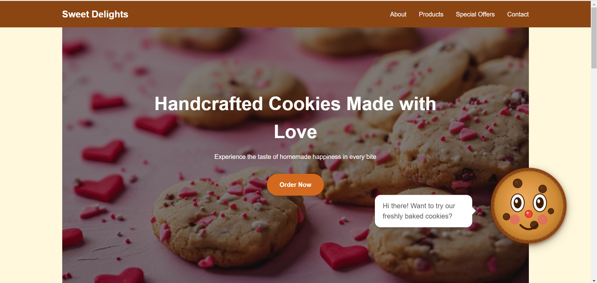
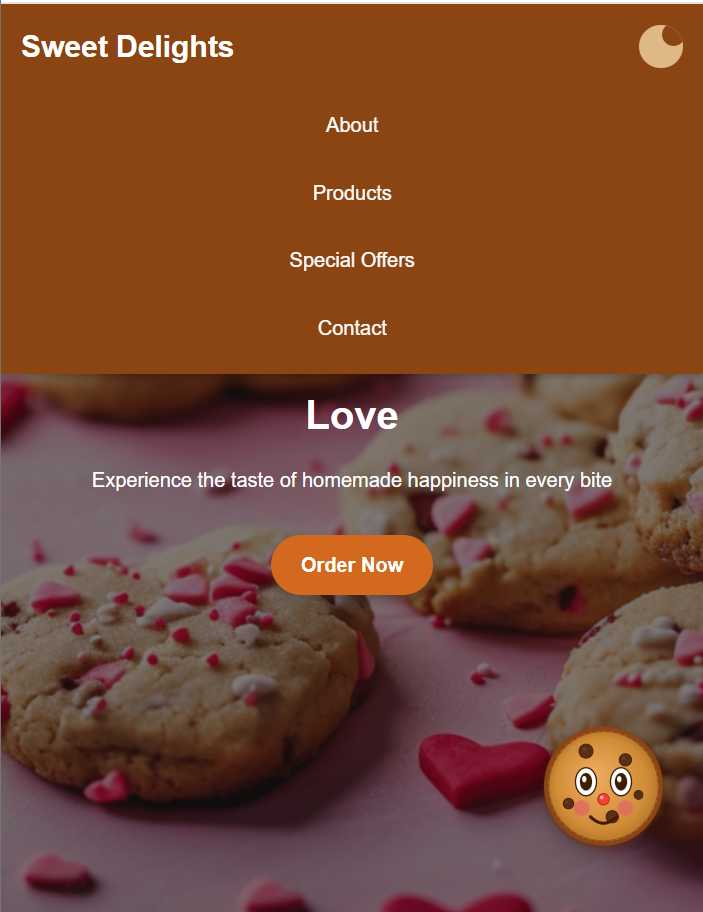
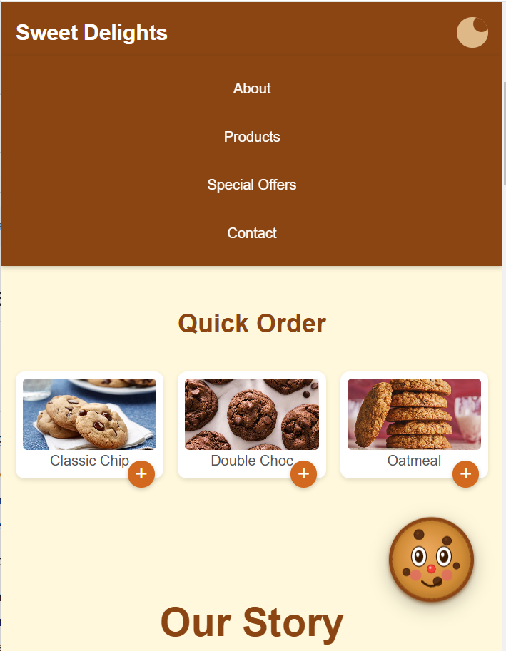

# Sweet Delights Cookie Shop Landing Page

A responsive and visually appealing landing page designed for "Sweet Delights Cookie Shop," a fictional bakery specializing in delicious homemade cookies. This landing page serves as an online storefront, highlighting the shop's best-selling cookies, exclusive deals, and a user-friendly contact form for inquiries or orders. With an inviting design and smooth user experience, customers can easily explore the offerings and get tempted by the sweet treats available.

## Features
- Enhanced responsive design for seamless user experience across all devices
- Smooth scroll navigation for effortless browsing
- Engaging product showcase to highlight brand's products
- Interactive contact form for easy inquiries and feedback
- Dedicated special offers section to attract customers
- Visually appealing animated mascot that performs a full rotation when clicked
- Mobile-friendly toggle menu to conveniently hide navigation options on smaller screens
- Quick order selection button, exclusive to mobile screens, for faster and more accessible purchases

## Live link on github

https://livia994.github.io/lab2pw/

## Screenshots

## Screenshots with my mascot and Mobile Screen Only Improvements
Cookie-Mascot with message

Hidden Menu for Mobile Screen Only

Quick Order Selection for Mobile Only
